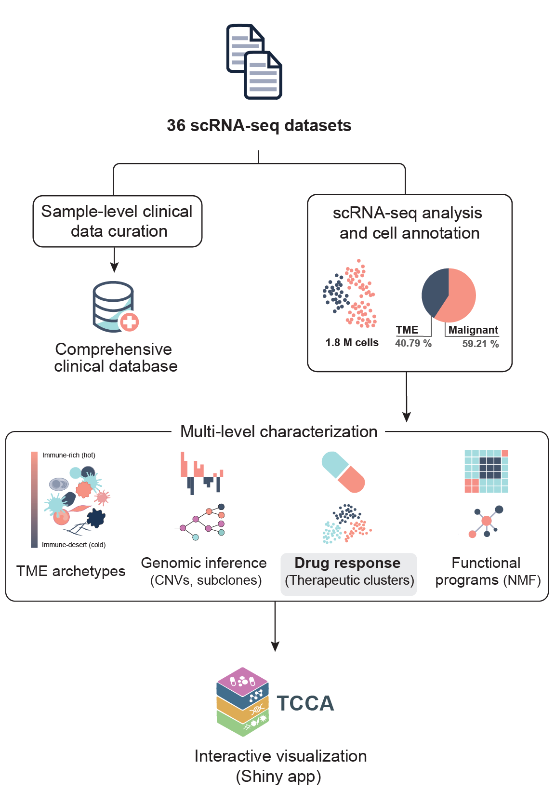

# The Therapeutic Cancer Cell Atlas (TCCA)

## Overview
This repository contains all code and workflows used to preprocess, analyze, 
and visualize the **Therapeutic Cancer Cell Atlas (TCCA)** — an integrated 
single-cell atlas with therapeutic predictions built from publicly available datasets.  
It includes a Snakemake-based pipeline for preprocessing GEO single-cell expression data, 
and modular scripts for functional, therapeutic, and tumor microenvironment analyses.

## Features

    <picture>
    <source media="(prefers-color-scheme: dark)" srcset="./.img/general_workflow_dark.png">
    <source media="(prefers-color-scheme: light)" srcset="./.img/general_workflow.png">
    
    </picture>

## Requirements

